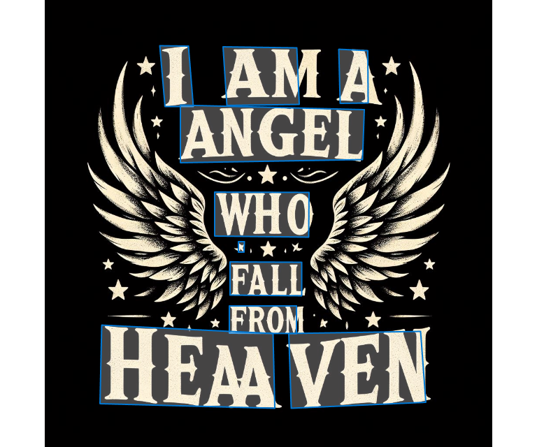
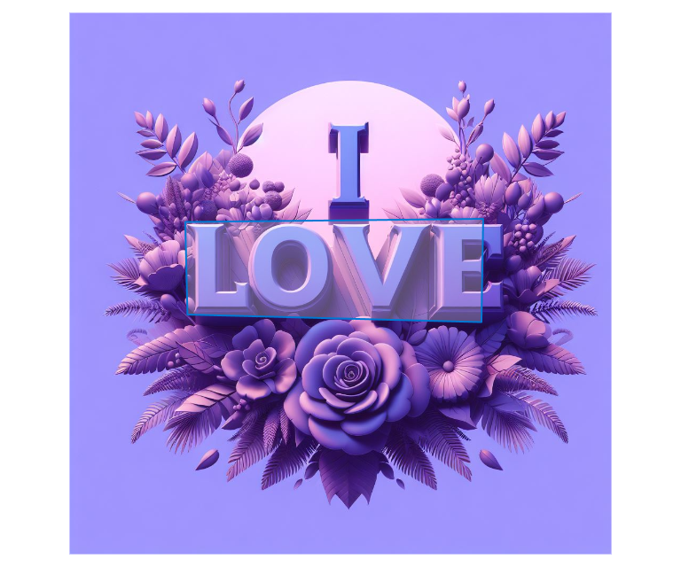

# Web Dio Azure Vision

Projeto demonstrando o uso do Vision Studio no reconhecimento visual, facial, letras, legendas, etc. As pastas input e outputs contem imagens usadas como entradas e o print de suas respectivas saídas.

## 1 - Um detalhe da imagem que foi incorretamente reconhecido como o caractere X, mas no geral o acerto foi de 99.9999%, então o resultado foi excelente para o Azure Vision

## 2 - Houve alguns caracteres que não foram reconhecidos como a letra I da foto abaixo, mas acredito que isso deve ser uma rara excessão

## 3 - Sem erros

## 4 - O Vision Studio pode ser útil para demonstrar a tecnologia de I.A para potenciais clientes.